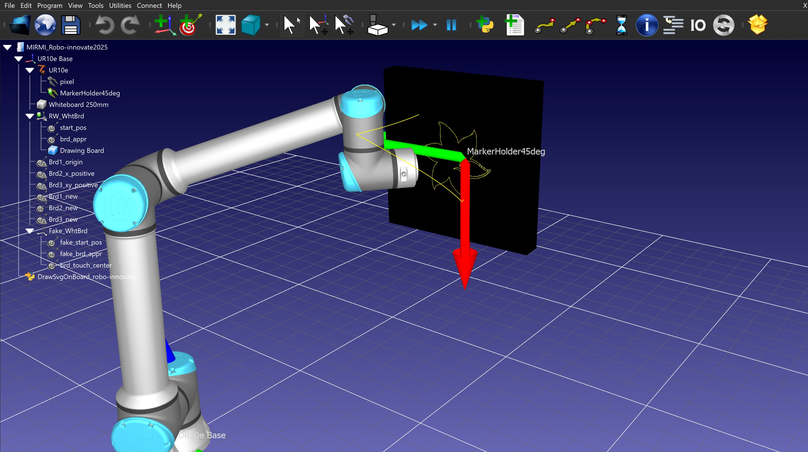

# Challenge N°6: No-Code Cobot

**Welcome to the robo.innovate Hackathon 2025!** In this challenge, your team will be tasked with implementing an intuitive user interface for teleoperating a Universal Robots UR10 Cobot.

**Lets get drawing!** The robot is set up with a marker at its end-effector, and its task will be to make drawings on a white board. We provide you with a script which implements the pipeline from image to robot motion.

In this repository you will find instructions and the necessary files to get your simulated UR10 running in the RoboDK software. We have also included some resources that you might find useful during the development of your solution.

## Installing RoboDK

RoboDK is a powerful robotic simulation and offline programming software that allows users to program industrial robots without needing to write complex code manually. It supports a wide range of robot brands (like KUKA, FANUC, ABB, and UR) and enables tasks such as path planning, robot calibration, collision detection, and integration with CAD/CAM software.

Installing and using RoboDK is necessary for this challenge. It allows teams to simulate and test their solutions quickly. You can download it from this [link](https://robodk.com/download). Note that this is a 30-day trial, which should be plenty for our 4-day hackathon.

RoboDK is available for Windows, Mac, and Ubuntu. Feel free to use your prefered platform, but we recommend to use Windows. In our experience it runs a bit faster, and it doesn't have an issue with saving the script that we will see later on.

## Using RoboDK

If everything worked out during installation, when starting RoboDK you should get an empty world with one reference frame.


We have provided on this repository a **.rdk** file. A .rdk file is a project file used by RoboDK to store robot simulations, programs, tool definitions, and workcell setups. It acts as a container that saves all the components of a RoboDK project, including 3D models, robot paths, and configurations.

You can open the prepared project in two ways: Double click on the .rdk file provided, or in an empty project go to **>File>..Open** and select the corresponding file. You should see the following setup.


Great! You don't need to worry about most of the things shown. The colored arrows are the reference frames of the base, end-effector, starting points, and points used for calibrating the robot. For less visual clutter, toggle the visibility of the later two by going to their respective element on the project tree (left side), selecting it and pressing F7.

## Drawing SVG on Board script

At the end of the project tree you'll find the *DrawSvgOnBoard_robo-innovate.py* script. Right click on it and select **Edit Python Script** to inspect its contents. You will note that the script defines the variable **IMAGE_FILE**, which determines the SVG file to be drawn by the robot. It can be a local file path or a URL to an external file.

The code imports the **svgpathtools** library. Using the RoboDK built in Python interpreter will not work, since the library will not be found. You can try this by double clicking on the script from the project tree. Since you most likely will require more external libraries as well, we recommend you change the Python interpreter following the instructions in the section **Troubleshooting Python setup in RoboDK** found [here](https://robodk.com/doc/en/RoboDK-API-Python-API.html). To install the library in your own environment, simply

```
pip install svgpathtools
```

On the same link, you can find information on changing the text editor to one of your liking. **Note:** If you open the script on a text editor and modify it, the changes will not be reflected on the RoboDK script, as this are not the same. The RoboDK project stores the script on a temp folder. Therefore, changes to the script file will not be reflected on the simulation, if made outside of RoboDK. There is also a known issue where in Ubuntu, changes to the script from inside RoboDK using the Python Idle might not be saved.

After setting up Python with the needed libraries, test the script by double clicking on it. The robot should start drawing a flower!



Note that the yellow line is not the drawing made by a marker, but rather the path followed by the tool center point, as evidenced by the line coming out of the board.

A nice aspect of simulating is that we can speed up the process. On the toolbar, press the **Fast Simulation** icon for, you guessed it, a faster simulation. You can also set the default speed to one of your liking!


**Important:** The implementation of how the robot moves should not be modified. We have provided a pipeline that takes an SVG file as input, and performs the motion of the robot so that it draws said SVG. While you can modify it if you want, know that when operating the real robot, we will be using the original script. 

Your task is to implement a user interface which outputs a valid SVG for the robot to draw. How it outputs it is completely up to you! Search for images online? Make the user draw and convert that to an SVG? Tell an AI to give you a drawing? The freedom is yours!

## Scalable Vector Graphics

An SVG is an XML-based vector image format. They are resolution-independent, meaning they can be scaled in size without loss of quality. Instead of an array of pixels of different colors, an SVG defines shapes using math. You can [read more](https://www.w3schools.com/graphics/svg_intro.asp) about how to create an SVG, or how to make sense of one you've found online. It is important to understand the different elements found on an SVG (\<circle>, \<line>, \<path>, etc).


We mentioned that the python script takes in a **valid** SVG before. This refers to SVG's that the svgpathtools parser can decompose into a series of paths for the robot to follow. As you will most likely see, the parser can be quite picky. The parsing and transformation from an SVG to a series of path the robot can follow are done by the **svg2paths** method, the implementiation of which can be found [here](https://github.com/mathandy/svgpathtools/blob/master/svgpathtools/svg_to_paths.py).

To see the XML code behind an SVG, simply open it with a text editor. If you are using VSCode and the editor shows the image, right click on the file's tab and choose **Re-open Editor With...**, which will allow you to choose between seeing the SVG as an image or as code.

## Further Resources

- [Inkscape](https://inkscape.org/) for creating and working with SVG's.
- For more details on RoboDK, check out their [documentation](https://robodk.com/doc/en/Getting-Started.html).
- Recent [paper](https://arxiv.org/pdf/2308.11187) discussing algorithms for converting images to line art.
- Youtube [video](https://www.youtube.com/watch?v=K-WPry8ltXU) of the state of the art.
- [Git repository](https://gitlab.lrz.de/hackathon_image_conversion/image_conversion) for creating line drawings from photographs.
- The SVG extension in VSCode.

Can't reach me in person or through the given communication channels? Write me an email to ignacio.dassori@robotum.info.